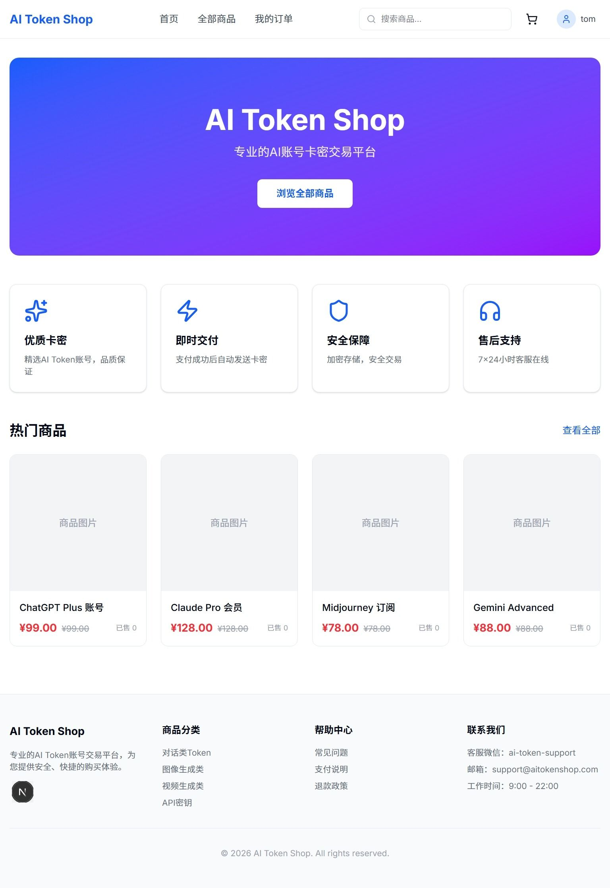
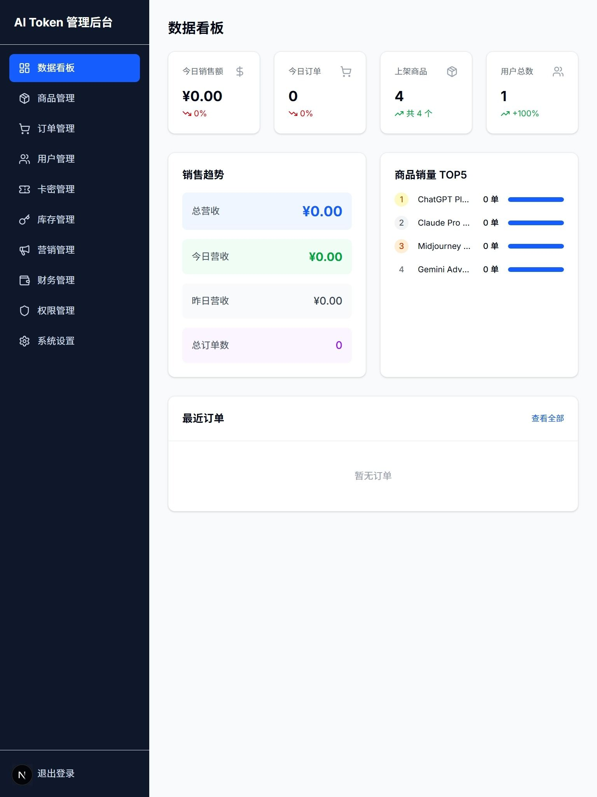

# AI Token Shop

**更新时间**: 2026-05-07

## 预览图
<div align="center">





</div>

---

## 项目概况

| 项目信息 | 详情 |
|---------|------|
| **技术栈** | Next.js 16.2.4 + React 19.2.4 + Prisma 7.8.0 + PostgreSQL + NextAuth 5 |
| **项目类型** | AI Token 电商平台 (卡密交易) |
| **包管理** | Bun 1.x |
| **测试框架** | Vitest 4.1.5 (52 tests) |
| **构建状态** | ✅ 构建成功 (45 routes) |
| **数据库** | PostgreSQL 18.3 (端口 5432) |
| **远程仓库** | GitHub (commit per feature) |

---

## ✅ 数据库配置 (已完成)

### 数据模型 (18个表)

| 模型 | 用途 | 状态 |
|------|------|------|
| User | 用户账户 | ✅ |
| Category | 商品分类 | ✅ |
| Product | 商品信息 | ✅ |
| TokenKey | AI Token卡密 | ✅ |
| TokenType | Token类型枚举 | ✅ |
| KeyType | 卡密类型枚举 | ✅ |
| KeyStatus | 卡密状态枚举 | ✅ |
| Order | 订单 (7状态) | ✅ |
| OrderItem | 订单明细 | ✅ |
| Payment | 支付记录 | ✅ |
| Settlement | 结算记录 | ✅ |
| CartItem | 购物车 | ✅ |
| Coupon | 优惠券 | ✅ |
| UserCoupon | 用户优惠券 | ✅ |
| Promotion | 促销活动 | ✅ |
| Review | 商品评价 | ✅ |
| AdminUser | 管理员 | ✅ |
| AdminRole | 管理员角色 | ✅ |
| OperationLog | 操作日志 | ✅ |

---

## ✅ P0 核心功能 (全部完成)

### 用户端 (shop/)

| 页面/功能 | 文件路径 | 状态 | 备注 |
|-----------|----------|------|------|
| 首页 | `src/app/shop/page.tsx` | ✅ | |
| 登录 | `src/app/shop/login/page.tsx` | ✅ | NextAuth credentials |
| 注册 (含自动登录) | `src/app/shop/register/page.tsx` | ✅ | signIn("credentials") on success |
| 商品列表 | `src/app/shop/products/page.tsx` | ✅ | 分类筛选、排序 |
| 商品详情 | `src/app/shop/products/[id]/page.tsx` | ✅ | AddToCartButton (session-aware) |
| 购物车 | `src/app/shop/cart/page.tsx` | ✅ | session + localStorage fallback |
| 结账 | `src/app/shop/checkout/page.tsx` | ✅ | 支付方式选择、订单创建 |
| 用户中心 | `src/app/shop/user/page.tsx` | ✅ | session-based |
| 用户设置 | `src/app/shop/user/settings/page.tsx` | ✅ | 昵称、头像编辑 |
| 我的订单 | `src/app/shop/user/orders/page.tsx` | ✅ | session + localStorage |
| 我的卡密 | `src/app/shop/user/tokens/page.tsx` | ✅ | 显示已购买卡密、复制 |
| 演示支付 | `src/app/shop/pay/demo/page.tsx` | ✅ | 模拟支付+卡密自动发放 |

### 管理后台 (admin/)

| 页面/功能 | 文件路径 | 状态 | 备注 |
|-----------|----------|------|------|
| 数据看板 | `src/app/admin/dashboard/page.tsx` | ✅ | 实时Prisma统计 |
| 商品管理 | `src/app/admin/admin-products/page.tsx` | ✅ | CRUD、上架/下架 |
| 订单管理 | `src/app/admin/orders/page.tsx` | ✅ | 列表、状态筛选 |
| 订单详情 | `src/app/admin/orders/[id]/page.tsx` | ✅ | 状态流转、卡密显示 |
| 用户管理 | `src/app/admin/users/page.tsx` | ✅ | 搜索、筛选、封禁/解封、分页 |
| 卡密管理 | `src/app/admin/tokens/page.tsx` | ✅ | 生成、筛选、复制 |
| 库存管理 | `src/app/admin/inventory/page.tsx` | ✅ | 重定向至卡密管理 |
| 财务管理 | `src/app/admin/finance/page.tsx` | ✅ | (mock) |
| 营销管理 | `src/app/admin/marketing/page.tsx` | ✅ | (mock) |
| 系统设置 | `src/app/admin/settings/page.tsx` | ✅ | (form UI) |
| 登录页 | `src/app/admin/login/page.tsx` | ✅ | |

### API 路由 (23个)

| 路由 | 方法 | 用途 | 状态 |
|------|------|------|------|
| `/api/auth/[...nextauth]` | GET/POST | NextAuth认证 | ✅ |
| `/api/auth/register` | POST | 用户注册 | ✅ |
| `/api/products` | GET | 商品列表 | ✅ |
| `/api/products/[id]` | GET | 商品详情 | ✅ |
| `/api/cart` | GET/POST | 购物车 (session-aware) | ✅ |
| `/api/orders` | GET/POST | 订单创建/列表 | ✅ |
| `/api/pay` | GET | 支付入口 | ✅ |
| `/api/pay/wechat` | POST | 微信支付创建 | ✅ |
| `/api/pay/alipay` | POST | 支付宝创建 | ✅ |
| `/api/pay/demo-process` | POST | 演示支付处理+卡密分发 | ✅ |
| `/api/pay/wechat/notify` | POST | 微信回调 | ✅ |
| `/api/pay/alipay/notify` | POST | 支付宝回调 | ✅ |
| `/api/tokens` | GET | 用户卡密列表 | ✅ |
| `/api/user/profile` | GET/PUT | 用户资料 | ✅ |
| `/api/admin/login` | POST | 管理员登录 | ✅ |
| `/api/admin/products` | GET/POST/PUT/DELETE | 商品管理 | ✅ |
| `/api/admin/orders` | GET/PUT | 订单管理 | ✅ |
| `/api/admin/orders/[id]` | GET/PUT | 订单详情 | ✅ |
| `/api/admin/orders/expire` | POST | 订单自动过期取消 | ✅ |
| `/api/admin/users` | GET/PUT | 用户管理 | ✅ |
| `/api/admin/tokens` | GET/POST | 卡密管理 (含批量生成) | ✅ |
| `/api/admin/coupons` | GET/POST/PUT/DELETE | 优惠券CRUD | ✅ |
| `/api/admin/stats` | GET | 统计数据 | ✅ |
| `/api/coupons/validate` | POST | 优惠券校验 (用户端) | ✅ |

---

## 🧪 测试覆盖

| 测试文件 | 数量 | 状态 |
|----------|------|------|
| `src/lib/order-machine.test.ts` | 43 tests | ✅ 订单状态机 (7状态、有效/无效转换) |
| `src/app/api/user/profile/validation.test.ts` | 10 tests | ✅ 用户资料Zod校验 |
| `src/lib/order-expiry.test.ts` | 13 tests | ✅ 订单过期检测 (filter/build/getRemaining) |
| `src/lib/coupon-validator.test.ts` | 14 tests | ✅ 优惠券校验 (固定/百分比、日期、金额) |

**总计: 79 tests ✅ all passing**

---

## 📋 P1 待完成 (重要功能)

| 序号 | 功能 | 现状 | 预计工作 |
|------|------|------|----------|
| 1 | 真实支付SDK接入 (微信/支付宝) | stub模式 | 3-5天 |
| 2 | 优惠券系统 | ✅ 已完成 | - |
| 3 | 促销活动 (秒杀/团购/满减) | Prisma模型就绪 | 3天 |
| 4 | 管理员权限/角色系统 | Prisma模型就绪 | 2天 |
| 5 | 商品评价系统 | Prisma模型就绪 | 1天 |
| 6 | 订单自动过期取消 | ✅ 已完成 (13 tests) | - |
| 7 | 结算/分账系统 | mock数据 | 2天 |

### P2 增强功能

| 序号 | 功能 | 预计工作 |
|------|------|----------|
| 8 | 数据报表分析 (图表) | 3天 |
| 9 | 消息通知 (站内信) | 2天 |
| 10 | 帮助中心/FAQ | 2天 |
| 11 | 搜索和筛选增强 | 1天 |
| 12 | AI Token专区 | 2天 |

### P3 优化功能

| 序号 | 功能 | 预计工作 |
|------|------|----------|
| 13 | 移动端响应式适配 | 2天 |
| 14 | 性能优化 (缓存、图片) | 1天 |
| 15 | SEO优化 | 1天 |
| 16 | 日志和监控 | 2天 |
| 17 | CI/CD配置 | 1天 |

---

## 📊 完成度统计

```
总体进度: █████████████████░░░░ 85%

核心功能 (P0): ████████████████ 100%  ✅ 全部完成
  - 用户注册/登录: ✅ 含自动登录、session-aware
  - 商品/购物车/订单: ✅ 状态机、完整流转
  - 支付系统: ✅ demo流程+卡密自动发放
  - 卡密生成/发放: ✅ 批量生成、库存联动、用户查看
  - 管理后台: ✅ 看板/商品/订单/用户/卡密全实时数据

重要功能 (P1): ██████████░░░░░░░░ 50%
  - 优惠券系统: ✅ 已完成 (14 tests, admin CRUD + checkout)
  - 订单自动过期: ✅ 已完成 (13 tests, API endpoint)
  - 数据库模型就绪: ✅ 100%
  - 促销/权限/评价: ❌ 待实现

测试覆盖: ██████████████░░░░░░ 70%
  - 状态机测试: ✅ 43 tests
  - 过期检测: ✅ 13 tests
  - 优惠券校验: ✅ 14 tests
  - 校验测试: ✅ 10 tests
```

---

## 🛠 技术债务

1. **支付stub** → 需要接入真实微信/支付宝SDK
2. **类型安全** → 个别API使用 `any` 类型，需逐步替换为Zod
3. **错误边界** → 需要统一全局 ErrorBoundary
4. **API文档** → 缺少OpenAPI/Postman文档
5. **P1剩余** → 促销活动/权限系统/商品评价/结算分账

---

## 📁 完整项目结构

```
ai-token-shop/
├── prisma/schema.prisma       # 18+ 数据模型/枚举
├── src/
│   ├── app/
│   │   ├── api/               # API路由 (21个)
│   │   ├── shop/              # 用户端 (12个页面)
│   │   └── admin/             # 管理后台 (12个页面)
│   ├── components/
│   │   ├── admin/             # 侧边栏、布局包装
│   │   └── shop/              # 头部、底部
│   ├── lib/                   # 工具库
│   │   ├── auth.ts            # NextAuth配置
│   │   ├── prisma.ts          # Prisma单例
│   │   ├── types.ts           # ApiResponse类型
│   │   ├── utils.ts           # 辅助函数
│   │   └── order-machine.ts   # 订单状态机 (43 tests)
│   ├── generated/prisma/      # Prisma生成客户端
│   └── proxy.ts               # Next.js 16 请求代理
├── vitest.config.ts           # Vitest配置
├── AGENTS.md                  # 项目知识库
└── PROJECT_PROGRESS.md        # 本进度报告
```

---
